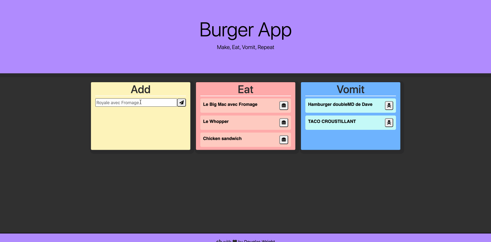
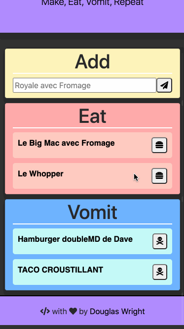

# Burger App

Eat-Da-Burger! is a restaurant app that lets users input the names of burgers they'd like to eat. A user submits a burger's name, and it is displayed on the left side of the page -- waiting to be devoured. Each burger in the waiting area also has a `Devour it!` button. When the user clicks it, the burger will move to the right side of the page.

A simple demo of a fullstack application, Eat-Da-Burger! is hosted in Heroku & utilizes a Node backend, using a RESTful API routed with Express that makes requests to a MySQL database & ultimately serves the user a view using Handlebars templates.

<p align="center">
   
   
</p>

## Installation & Getting Started (remotely)
* [hosted site](https://add-devour-vomit-burger.herokuapp.com)
* [repo](https://github.com/Spazcool/burger-app)

## Installation & Getting Started (locally)

1. Clone from the [Repo](https://github.com/Spazcool/burger-app): 
  ```
  git clone https://github.com/Spazcool/burger-app.git
  ```
2. Install dependencies:
  ```
  npm install
  ```
3. Create .env file at root directory, change values as needed (for use with MySQL database):
  ```
  DB_PASSWORD='password'
  DB_HOST='localhost'
  DB_USER='root'
  DB_NAME='burgers_db'
  DB_PORT='3306'
  ```
4. Create MySQL Database:
  * Install: 
    * [MySQL Install (Mac)](https://dev.mysql.com/doc/mysql-osx-excerpt/5.7/en/osx-installation-pkg.html)
    * [MySQL Workbench](https://www.mysql.com/products/workbench/)
  * Run MySQL, from System Prefrences.
  * Open MySQL Workbench
    * Copy/paste [seed file](db/seed.sql) from this repo
    * Run seed

5. Run application:

  ```
  node server.js
  ```

## Prerequisites

* Node.js

## Built With

* Node
* Express
* MySQL
* Bootstrap
* Handlebars
* Heroku

## Authors

* **Douglas Wright** - [Spazcool](https://github.com/Spazcool)

## Acknowledgements

* [Sticky Footer](https://getbootstrap.com/docs/4.0/examples/sticky-footer/) 

## License

This project is licensed under the MIT License - see the [LICENSE.md](LICENSE.md) file for details.
